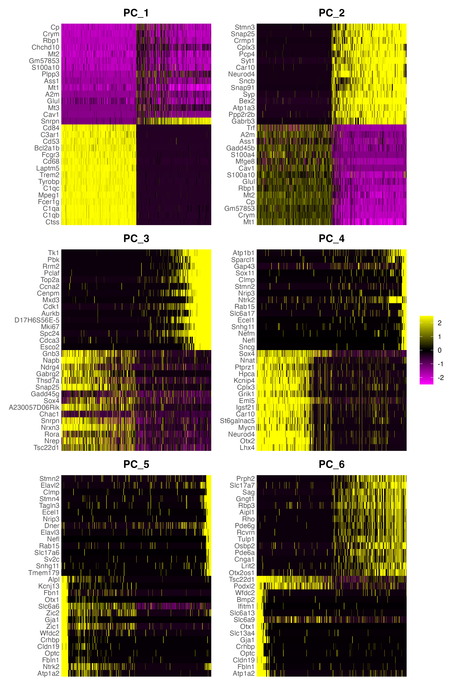
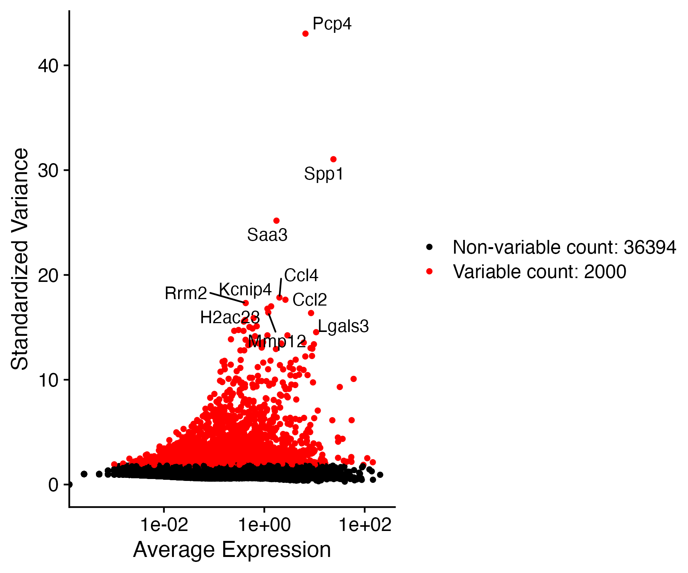
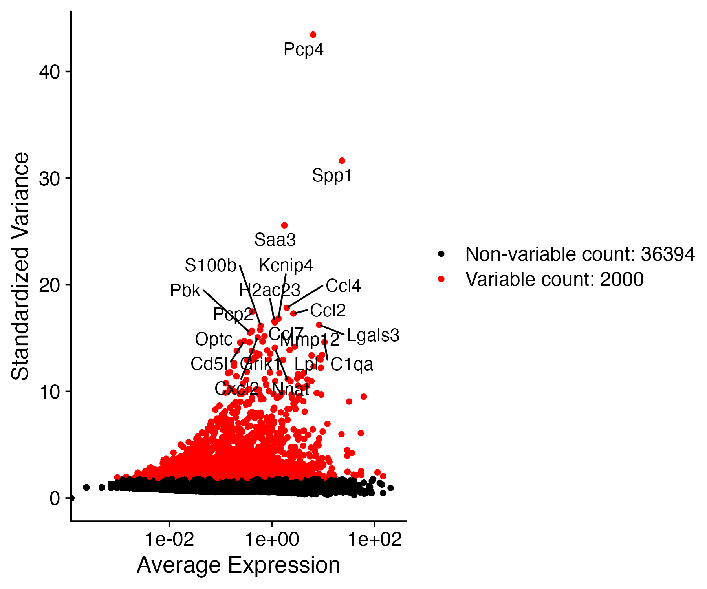
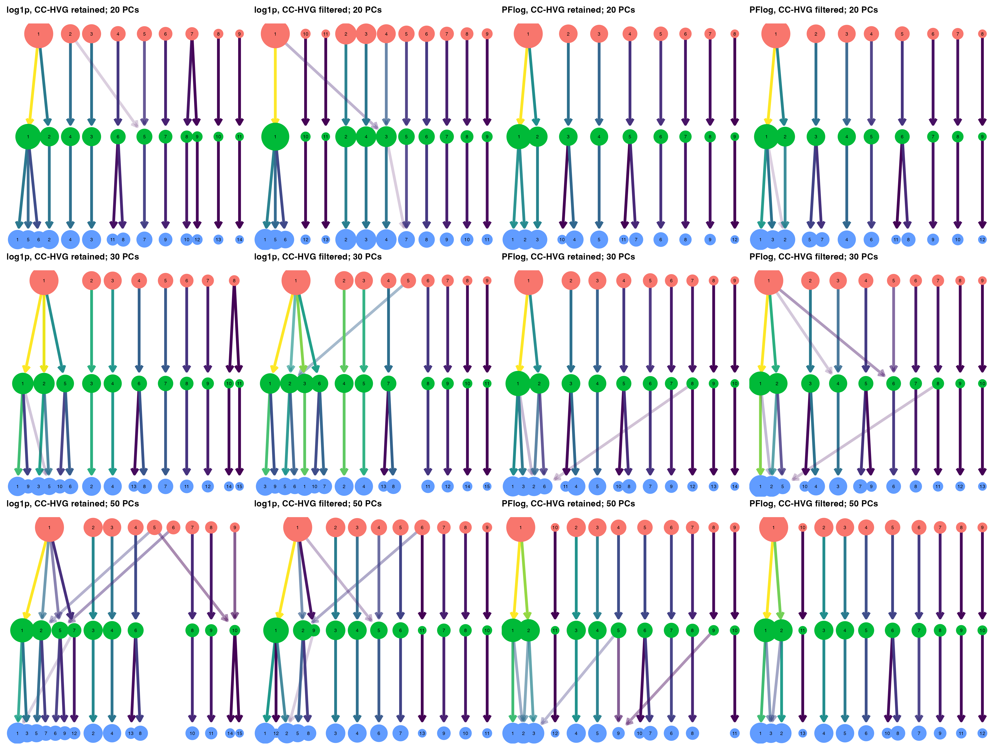
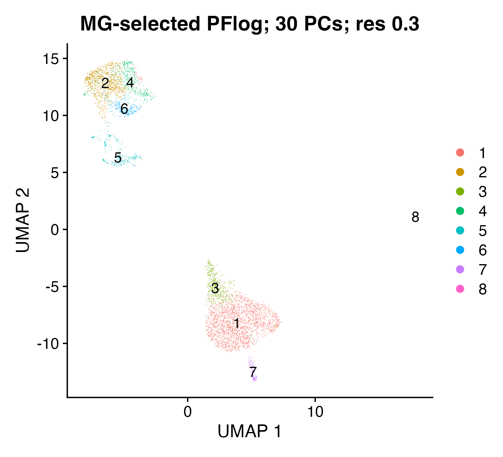
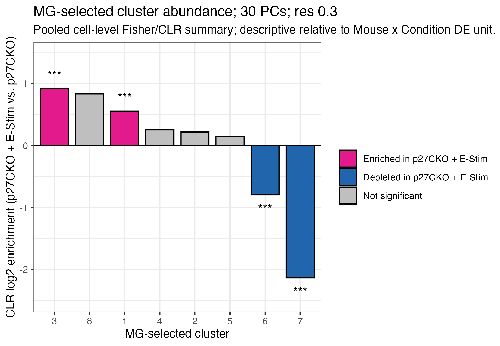
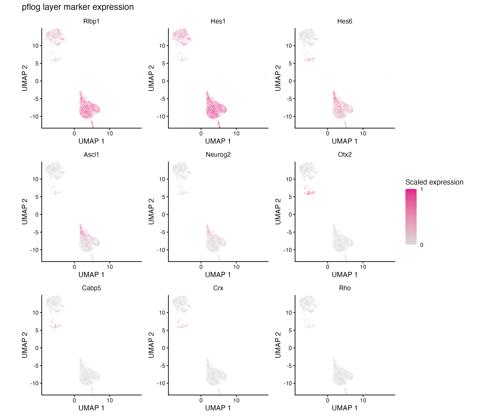
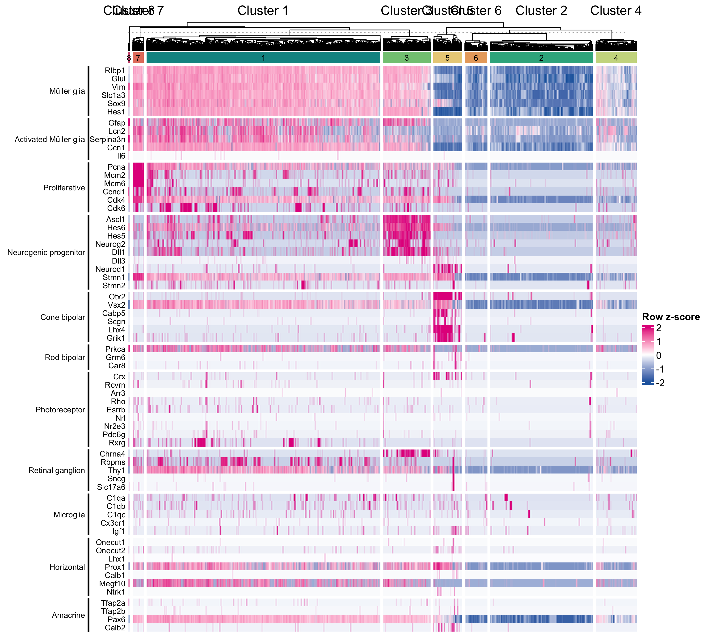

```{r}
#| label: package-load
#| include: false
library(Seurat)
```


## Data p(re)processing and analysis

I used the Seurat object from Trailmaker as the input for this analysis. I am overwriting all processing, transformations, reductions, etc., but the initial QC filtering that Megan did subsets the object, so that remains in place.

The analysis is being done both with and without cell-cycle genes (S/G2/M) filtered out of HVGs. These analyses are complementary, so we can compare the results to see if the cell cycle genes are driving any of the clustering results, but DEG results are based on counts, which are not affected by HVGs, so those are the same in both analyses.

Pre-processing steps:

1. Normalize counts: adjust expression values for library-size and compositional differences across cells. This pipeline does not perform gene-length normalization.
2. Scale the data: centers and scales the expression values of each gene across all cells.
3. Identify highly variable genes (HVGs): identifies the 2000 genes that are most variable across all cells. This selects the most "informative" genes for downstream analysis, removing genes that could add noise but not signal.
4. Run PCA and select number of PCs to keep for downstream analysis.

### Normalization

There are two good options for normalization:

1. log1p normalization (Seurat default):
  $$
  y_{gc} = \log(1 + \frac{x_{gc}}{N_c} \cdot 10^6)
  $$ {#eq-log1p-normalization}
  * where $x_{gc}$ is the raw count for gene $g$ in cell $c$, and $N_c$ is the 
  total counts for cell $c$.
  * This is the default normalization method in Seurat. It normalizes the counts to account for differences in sequencing depth and technical factors.
2. PFlog normalization (`scclrR`):
  $$
  y_{gc} = \log(x_{gc} + \alpha) - 
    \frac{1}{G} \sum_{g=1}^G \log(x_{gc} + \alpha)
  $$ {#eq-pflog-normalization}
  * where $\alpha$ is the estimated overdispersion of counts in cell $c$, and 
  $G$ is the total number of genes.
  * This is equivalent to a centered log-ratio transform of the counts where 
  each side of the transformation is shifted by $\alpha$, effectively 
  functioning as a pseudocount.
  $$
  y_{gc} = \log \frac{x_{gc} + \alpha}{Gmean_c(x + \alpha)}
  $$ {#eq-pflog-normalization-2}
  * This is a shifted centered log-ratio transformation, using the Aitchison
  compositional-data framework with a pseudocount adapted for single-cell counts.

**Choice 1**: I am carrying both log1p and PFlog branches through preprocessing so we can see whether downstream PCA, clustering, and marker interpretation are robust to normalization. PFlog is promising because it is designed for compositional count data and has a relevant single-cell benchmark (Booeshaghi 2026 bioRxiv), but we should keep the claim scoped to this ESPI analysis before treating it as the primary normalization.

### Choosing PCs

I tried a "principled" way to choose PCs but I think that's getting too fancy. 
Everyone says to just eyeball it, so that's what we'll do. The most common 
heuristic is the elbow plot: pick a number of PCs that's safely past the elbow.

::: {#fig-elbows layout-ncol=2}

{#fig-elbow-log1p}

{#fig-elbow-pflog}

:::

PFlog normalization has a steeper elbow in these plots. That pattern is  consistent with stronger variance stabilization, but the elbow plot alone does not identify the cause. I'm doing downstream analyses with both at $\mathrm{PC} = \{20, 30, 50\}$ to see how normalization affects clustering and marker segregation. Those will be supplemental figures.

:::: {#fig-hvg-heatmap layout-nrow=2}

{#fig-heatmap-log1p-nofilter}

{#fig-heatmap-log1p-filter}

{#fig-heatmap-pflog-nofilter}

{#fig-heatmap-pflog-filter}

For each PC, the heatmap displays the default top loading features selected by `Seurat::DimHeatmap()` across 500 cells. These plots show PCs 1--6 as a diagnostic for whether early PCs are dominated by cell-cycle or other technical programs.

::::

### Selecting HVGs

We'll use the default 2000 HVGs, with and without cell cycle genes removed. 
These plots label the top 20 retained HVGs in each branch.

::: {#fig-hvg-scatter layout-nrow=2}

{#fig-hvg-log1p-nofilter}

{#fig-hvg-log1p-filter}

{#fig-hvg-pflog-nofilter}

{#fig-hvg-pflog-filter}

:::

## Clustering

Clustering uses a KNN graph followed by Leiden community detection. I am sweeping the parameter grid across normalization method, cell-cycle-HVG policy, PC count, and resolution so the chosen clustering is not tied to one hidden parameter choice.

The supplemental grid summary table is written to `/Users/carlstone/Library/CloudStorage/Box-Box/megan_sc_data/tables/cluster/cluster_grid_summary.tsv`. It contains one row per clustering configuration, including cluster counts, cluster-size summaries, ARI, and best-overlap Jaccard summaries against the current reference clustering:
`cluster_pflog_filter_cc_dims50_res0.3`.

### Clustering resolution

Low resolution gives fewer clusters, while high resolution gives more clusters. The same numeric resolution is useful for controlled branch comparisons, but it is not an absolute biological scale because each preprocessing branch changes the neighbor graph. The clustree grid below shows all normalization\ ×\ cell-cycle-HVG\ ×\ PC combinations; each panel contains the 0.3, 0.5, and 0.8 resolution sweep. Within a clustree panel, node position is a graph-layout aid; the edge structure, node size, and split pattern are the interpretable parts.

{#fig-clustree-grid}

Here's an example of one of the UMAP resolution sweeps. This uses PFlog normalization, cell-cycle HVG filtering, and 50 PCs. Resolution 0.3 has the most stable clusters, but increasing to 0.5 or 0.8 can show substructure within the larger clusters.

{#fig-umap-resolution-sweep}

**Choice 2**: Based off the clustree and UMAP resolution sweeps, it looks like the best combination of normalization, number of PCs, and resolution is PFlog normalization, 50 PCs, and resolution 0.3. I'll use this for most downstream analyses, using the same settings for the cell-cycle filtered and non-filtered HVGs. We can use a higher resolution like 0.8 for subclustering later.

### MG-selected clustering

I scored the selected PFlog, non-filtered 50-PC, resolution-0.3 clusters with
`Seurat::AddModuleScore()` using `cell_type_marker_genes`, then handled
`Cdkn1b` (p27) as a separate expression/detection signal. The marker rule removes
microglia or photoreceptor calls only when the top module score is at least 0.5
and exceeds the runner-up score by at least 0.25. The `Cdkn1b` rule removes
clusters with expression and detection BH-adjusted Wilcoxon $q < 0.05$ and at
least 20% detected cells. In this run, cluster 4 met both microglia and `Cdkn1b`
rules, cluster 7 met the microglia rule, and clusters 9 and 10 met the `Cdkn1b`
rule, leaving 4,713 cells for the `mg-selected` dataset. Because `Cdkn1b`
filtering conditions the branch on p27 biology, interpret the downstream results
as the p27-low/negative MG-enriched branch requested here.

I reselected HVGs on `mg-selected`, reran PFlog PCA, and swept 20, 30, and 50
PCs with Leiden resolutions 0.3, 0.5, and 0.8, with and without cell-cycle HVG
filtering. The elbow plot is already flat by 20 PCs, so 30 PCs is safely past
the elbow without carrying as much tail variance as 50 PCs. Resolution 0.3 keeps
the major structure without the extra splitting seen at 0.5 and 0.8. I use the
PFlog, no-cell-cycle-filtered, 30-PC, resolution-0.3 clustering for downstream
figures and differential analysis.

{#fig-mg-selected-cluster-umap}

#### Descriptive pooled abundance

The Fisher/CLR cluster-abundance summary compares pooled p27CKO + E-Stim and
p27CKO cells within this chosen clustering. Bars show CLR log2 enrichment of
cluster abundance in p27CKO + E-Stim versus p27CKO; colors distinguish
enriched or depleted clusters with significant pooled cell-level Fisher tests
after Holm correction.
These bars are descriptive only and are not primary evidence for
condition-level abundance because they do not use the Mouse × Condition sample
as the statistical unit.

{#fig-mg-selected-cluster-abundance-clr-fisher}

#### Sample-level cluster-proportion screen

The primary screen for cluster-proportion shifts is a design-restricted
randomization test on Mouse × Condition samples. The paired-only statistic is
the mean within-mouse E-Stim − control stabilized logit-proportion difference
over paired mice 10 and 3. The paired-plus-singleton sensitivity adds mouse 30
(E-Stim only) and mouse 33 (control only) as one exchangeable unpaired block.

With two paired mice, the paired-only two-sided permutation p-value cannot fall
below 0.5; with the singleton block added, it cannot fall below 0.25. I
therefore interpret effect sizes and directional consistency, not conventional
significance thresholds. These tests condition on the frozen chosen cluster
labels; they do not claim that treatment created the clusters. Per-cluster
numbers are written to
`TABLE_DIR/mg_selected/mg_selected_cluster_proportion_randomization_pflog_mg_selected_no_filter_cc_dims30_res0.3.tsv`.

{#fig-mg-selected-cluster-proportion-by-mouse}

The marker heatmap below shows the same `mg-selected` clustering
(`cluster_pflog_mg_selected_no_filter_cc_dims30_res0.3`). Columns are cells split
by Leiden cluster, with cluster blocks hierarchically ordered by their
marker-expression profiles. Rows are marker genes grouped by their expected
cell-type labels. Colors show each gene's row z-score across cells, clipped to
$\pm 2$.

{#fig-mg-selected-cell-type-marker-heatmap}

The feature UMAP grid uses the marker feature list in `data/umap_feature_list.rda`
and the same pink high-expression endpoint as the marker heatmap.

{#fig-mg-selected-feature-umap-grid}

As a complementary check, I also reviewed the matching PFlog,
cell-cycle-filtered 30-PC, resolution-0.3 branch. First, the UMAP shows the
Leiden cluster IDs for that branch.

{#fig-mg-selected-filter-cc-cluster-umap}

{#fig-mg-selected-filter-cc-cell-type-marker-heatmap}

{#fig-mg-selected-filter-cc-feature-umap-grid}

### Cluster marker genes

Before running `FindAllMarkers()`, I inspected the chosen clustering on the UMAP
and curated marker heatmap for clusters that should be merged. I kept the
resolution-0.3 Leiden labels unchanged because no cluster pair had both
overlapping UMAP position and indistinguishable curated marker profiles. The
marker workflow records that decision with `--confirm-no-merge`; the cluster 2
null marker result below is new evidence against treating cluster 2 as its own
defensible interpreted identity, but it still does not identify a specific merge
partner. If later marker review supports a merge, rerun the workflow with an
explicit cluster map.

I used `Seurat::FindAllMarkers()` as a descriptive ranking of genes enriched in
each retained Leiden cluster relative to the other cells in this chosen
clustering. The clustering was built from the PFlog branch, but marker testing
uses Seurat's standard log-normalized `data` layer because Seurat's default
fold-change calculation is not valid for the PFlog layer. The script also keeps
only positive detection-enriched marker rows (`pct.1 > pct.2`), so marker
rankings do not report anti-markers as positive markers.

The result supports several clear programs: cluster 3 is enriched for
neurogenic-progenitor genes (`Ascl1`, `Hes6`, `Dll1`), cluster 7 is enriched for
cell-cycle genes (`Dscc1`, `Chaf1b`, `Pimreg`), and cluster 8 is a small 15-cell
outlier with strong `Cnmd`, `Cldn10`, `Scrg1`, `Htr1b`, and `Flt4` signal.
Cluster 1 has broad Müller/glial enriched genes including `Ugt1a1`, `Agt`, and
`Nherf1`. Cluster 5 has neuronal marker candidates including `Ttc9b`, `St8sia3`,
`Iqsec3`, `Lactbl1`, and `Cplx1`. Cluster 4 has only weak positive marker
separation, and cluster 6 includes mitochondrial/ribosomal markers (`mt-Rnr1`,
`mt-Rnr2`, `Rn18s-rs5`), so I treat those clusters cautiously as possible state
or technical/QC structure rather than clean interpreted identities. Cluster 2
has no genes detected more often than in the rest of cells under the positive
marker filter; that argues against treating cluster 2 as a marker-defined
identity, but it also does not identify a specific merge partner.

{#fig-mg-selected-find-all-markers-dotplot}

## Differential expression

I tested condition-level changes in the `mg-selected` branch with Mouse ×
Condition pseudobulk samples as the statistical unit. The primary DESeq2 design
used `~ condition` across all six Mouse × Condition samples. The paired
`~ mouse + condition` design used only mice 10 and 3, so I treat it as a
sensitivity analysis rather than the primary result.

Primary DESeq2 tested 24,514 genes and found 453 FDR-significant genes for
E-Stim versus `p27CKO`. Seven curated marker-list genes were significant:
`Glul` (Müller glia), `Ccn1` (activated Müller glia), `Hes6` (neurogenic
progenitor), `Mcm2`, `Mcm6`, and `Pcna` (proliferative), and `Grm6` (rod
bipolar). `Glul`, `Ccn1`, `Hes6`, and `Grm6` increased with E-Stim, while the
proliferative markers decreased. The strongest design-robust curated marker
signals are concordant in the primary and paired-sensitivity analyses:
increased `Glul` and `Ccn1` and decreased `Mcm2` and `Mcm6`. `Hes6`, `Pcna`,
and `Grm6` are primary-model hits but do not remain FDR-significant in the
paired sensitivity. `Serpina3n` is significant only in the paired sensitivity,
so I treat it as paired-subset support for activated Müller glia rather than a
primary all-sample marker hit.

The differential-detection (DD) analysis tests changes in the fraction of cells
with non-zero expression per gene, using the pseudobulk `edgeR_NB_optim`
workflow through `muscat::pbDS(method = "DD")`. Primary DD tested 36,468 genes
and found no FDR-significant genes or marker-list hits, so the primary evidence
does not support condition-level changes in detection for curated marker genes.
The paired sensitivity DD tested 34,880 genes and found 40 FDR-significant
genes, with no marker-list hits. Because this result uses only mice 10 and 3 and
is not supported by primary DD, I treat it as a within-paired-mice sensitivity
signal, not a general all-sample DD conclusion.

The DE/DD scatterplot compares condition effects for genes tested in both the DE
and DD analyses for each design, because the two workflows test different gene
universes. Points are genes, the x-axis shows the DE effect size, the y-axis
shows the DD effect size, color shows the FDR significance category (neither, DE
only, DD only, or both), and some points carry gene-name text labels.

{#fig-mg-selected-de-dd-effect-scatter}

As follow-up summaries of this selected branch, upregulated DEGs are enriched
for stress/growth and apoptotic-signaling terms, while downregulated DEGs and
preranked GSEA are dominated by cell-cycle, chromosome-segregation, and
DNA-replication terms.

