```{r}
#| label: package-load
#| include: false
library(Seurat)
```


## Data p(re)processing and analysis

I used the Seurat object from Trailmaker as the input for this analysis. I am overwriting all processing, transformations, reductions, etc., but the initial QC filtering that Megan did subsets the object, so that remains in place.

The analysis is being done both with and without cell-cycle genes (S/G2/M) filtered out of HVGs. These analyses are complementary, so we can compare the results to see if the cell cycle genes are driving any of the clustering results, but DEG results are based on counts, which are not affected by HVGs, so those are the same in both analyses.

Pre-processing steps:

1. Normalize counts: adjust expression values for library-size and compositional differences across cells.
2. Scale the data: centers and scales the expression values of each gene across all cells.
3. Identify highly variable genes (HVGs): identifies the 2000 genes that are most variable across all cells. This selects the most "informative" genes for downstream analysis (esp UMAP and clustering), removing genes that could add noise but not signal.
4. Run PCA and select number of PCs to keep for downstream analysis.

### Normalization

There are two good options for normalization:

1. log1p normalization:
  $$
  y_{gc} = \log(1 + \frac{x_{gc}}{N_c} \cdot 10^6)
  $$ {#eq-log1p-normalization}
  * where $x_{gc}$ is the raw count for gene $g$ in cell $c$, and $N_c$ is the 
  total counts for cell $c$.
  * This is the default normalization method in Seurat. It normalizes the counts to account for differences in sequencing depth and technical factors.
2. PFlog normalization (`scclrR`):
  $$
  y_{gc} = \log(x_{gc} + \alpha) - 
    \frac{1}{G} \sum_{g=1}^G \log(x_{gc} + \alpha)
  $$ {#eq-pflog-normalization}
  * where $\alpha$ is the estimated overdispersion of counts in cell $c$, and 
  $G$ is the total number of genes.
  * This is equivalent to a centered log-ratio transform of the counts where 
  each side of the transformation is shifted by $\alpha$, effectively 
  functioning as a pseudocount.
  $$
  y_{gc} = \log \frac{x_{gc} + \alpha}{Gmean_c(x + \alpha)}
  $$ {#eq-pflog-normalization-2}
  * This is a shifted centered log-ratio transformation, using math introduced by Aitchison (1982, 1986) with a pseudocount adapted for single-cell counts.

**Choice 1**: I am carrying both log1p and PFlog normalization methods through preprocessing so we can see whether downstream PCA, clustering, and marker interpretation are robust to normalization. PFlog is my preferred option because it's designed for compositional count data, it was recently benchmarked against other single-cell normalization methods (Booeshaghi 2026 bioRxiv) and shown to be better at stabilizing variance, which is relevant for our relatively small library sizes. It's also implemented by the Pachter group who are one of the big RNA-seq and single-cell software groups, so even though it's not yet in Seurat (I think because they have public beef with the Satija group who makes Seurat), this is very well-supported from mathematical theory, sc best practices, and their benchmarking paper.

### Choosing PCs

I tried a "principled" way to choose PCs before with all the resampling methods but I think that's getting too fancy. 
Everyone says to just eyeball it, so that's what we'll do. The most common 
heuristic is the elbow plot: pick a number of PCs that's safely past the elbow.

::: {#fig-elbows layout-ncol=2}

{#fig-elbow-log1p}

{#fig-elbow-pflog}

:::

PFlog normalization has a steeper elbow in these plots, which is what you want to see in an elbow plot. It's expected that if you have large artifacts from bad normalization, then you have more noise in all of your expression values, so you will have a shallower elbow, so PFlog is consistent with better normalization by that logic. I'm doing downstream analyses with both at $\mathrm{PC} = \{20, 30, 50\}$ to see how normalization affects clustering and marker segregation.

Normalization choice: **point for PFlog.**

Next, I looked at the top loading genes for each PC, for each normalization method and with/without cell-cycle gene filtering from HVGs, to see 1) how the top-loading genes are distributed within and across PCs and 2) if they change with normalization method or cell-cycle filtering. This is a diagnostic for whether early PCs are dominated by cell-cycle or other technical programs, to see if the variance is stabilized, and just to see if anything weird is happening like one gene dominates a PC.

:::: {#fig-hvg-heatmap layout-nrow=2}

{#fig-heatmap-log1p-nofilter}

{#fig-heatmap-log1p-filter}

{#fig-heatmap-pflog-nofilter}

{#fig-heatmap-pflog-filter}

::::

For each PC, the heatmap shows the top loading features across the top 500 cells for that feature. What we want to see here is the top-loading genes to be evenly spread across the top-expressing genes in each PC and not dominated by like one or a few genes. We see a few different patterns from this:

* Panel (a), log1p normalization, no cell-cycle filtering, PC1: very strong one way on a lot of the top-loading genes at the top half of the plot, but in the other direction some of the bottom half genes have strong expression the other way, some are just average or kinda up.
* Panel (b), log1p norm, cell-cycle filtering, PC3: both sides of PC3 are defined by a set of genes that's very strongly expressed in a relatively small subset of cells. This is generally what we don't want to see because it means that the PC is capturing strong variance in a smaller number of cells, and therefore is not as informative about the global structure of the data.
* Panel (c-d), PFlog normalization, PC1 for both: this is probably the ideal pattern for a PC, where we have strong expression of a number of genes in many cells. Note that the colors are kinda weird so black is higher than purple, meaning this more uniform black/yellow is a more even and high expression pattern than a spotty purple and yellow panel.

From all this, we want to pick the normalization method that gives us the most good PCs and the fewest bad PCs. This is obviously a qualitative assessment and kinda vibes-based, but from my research it seems that single-cell RNA-seq is very much vibes-based and in many ways hostile to strict cutoffs like I was trying to do, so my recommendation is that we go with vibes.

If I had to score the vibes from these plots, I'd say that log1p normalization, no CC-filtering, from PC1 to PC2, has the following vibes: pretty good for 1 and 2, medium for 3 and 4, kinda bad for 5 and 6. In contrast, PFlog normalization, no CC-filtering, has pretty good+ vibes for PC1, pretty good for PC2, and strongly medium for all the other PCs. In general, all of the top PCs for PFlog have the nice 2x2 checkerboard we want, while log1p has more PCs dominated by a few genes or cells.

Normalization: **another point for PFlog.**

### Selecting HVGs

Next, we select the highly variable genes (HVGs) for downstream analysis. This plot shows how they're selected based on the mean-variance relationship of the genes. The big impact of normalization is removing the effects of library size on the mean-variance relationship. You can't actually see that in this plot, we probably don't need to include these as supplements but I have four of them, one for each normalization/cc-filtering combination. Here's an example of the log1p normalized, no cc-filtering plot with the top 20 HVGs labeled. The other three are virtually identical, some of the top HVGs are different because cell cycle genes like Top2a drop out but these plots are boring.

{#fig-hvg-scatter}

## Clustering

For clustering, we put the PCA selected dims (here I use 20, 30, and 50 PCs to look at sensitivity to different selections) into a KNN graph and then do Leiden clustering on that. I am sweeping the parameter grid across normalization method, cell-cycle-HVG policy, PC count, and resolution so the chosen clustering is not tied to one hidden parameter choice.

I have a big table of all clustering configurations and their cluster counts, cluster-size summaries, and metrics for overlap between different parameter choices. I don't think we need to show that table necessarily, but maybe we extract a few values from it for a supplemental table. 

### Clustering resolution

Low resolution gives fewer clusters, while high resolution gives more clusters. I don't know exactly how resolution translates into the Leiden algorithm, but exact resolution values aren't really comparable between different neighbor graphs so these are more just rough cutoffs than a real biological or meaningful scale. What's more important at this step is looking at how the inputs (normalization method, cell-cycle filtering, and PC count) affect the stability of the clustering across resolutions. More stable clusters = more stable neighbor graph and more robust comparison between cells and clusters.

These are called clustree plots. For each panel, the normalization method, filtering status, and number of PCs is on the top left. Each panel has three clustering resolutions, 0.3 (red), 0.5 (green), and 0.8 (blue). The lines show how clusters split between the resolutions, color of the line indicating the count of cells moving between clusters (low->high: purple->green->yellow), and the transparency indicating what proportion of the child cluster is coming from that arrow.

Interpretation:

* Fewer clusters that split = more stable.
* Lines that cross = less stable.
* Even splits = fine
* Split, then cross = bad

{#fig-clustree-grid}

The stability summaries describe agreement across parameter choices; they do
not by themselves assign biological identities to clusters.

**Choice 2**: I use PFlog normalization, no-cell-cycle-HVG selection, 20 PCs,
and resolution 0.3 for the source clustering. This source clustering has eight
clusters and provides the input for the contaminant screen and the
`mg-selected` subset.

### Filtering out contaminant clusters

Here's what the selected dataset and processing parameters looks like. This is
the full dataset, nothing filtered yet. We could use the 0.8 resolution
clusters and then you can manually combine clusters if you want.

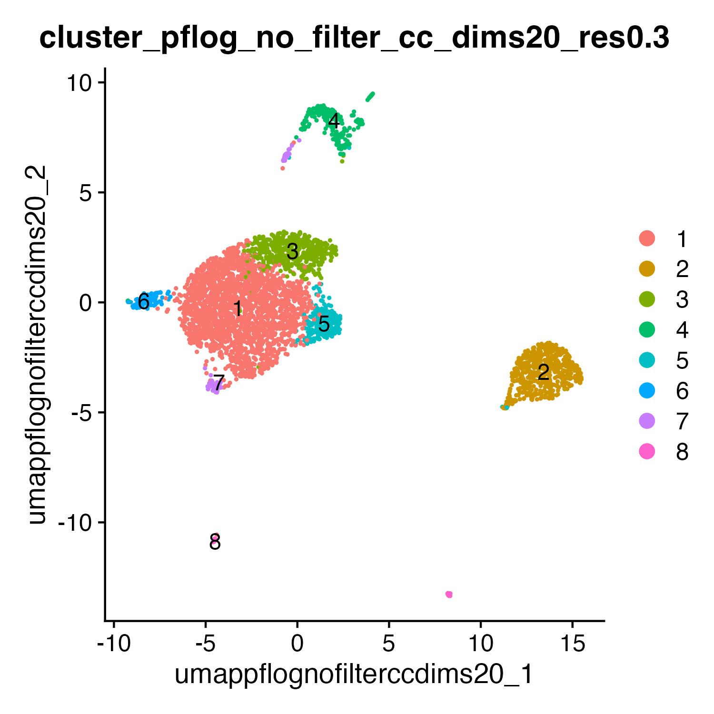{#fig-umap-resolution-sweep}

Next, I scored the expression of the cell type marker genes from the original manuscript heatmap (using Seurat::AddModuleScore()) and also scored p27 expression per cluster. 

{#fig-mg-full-module-p27-heatmap}

Cluster 2 (548 cells; microglia+p27) meets both the microglia-marker and high-p27
exclusion criteria. Clusters 7 (79 cells; p27) and 8 (37 cells; p27) meet the
high-p27 exclusion criterion. No cluster met the photoreceptor exclusion
criteria. I filtered out clusters 2, 7, and 8, retaining 3,238 cells, then
re-ran PCA and clustering on the remaining cells.

### MG-selected clustering

I reselected HVGs on `mg-selected`, reran PFlog PCA, and swept 20, 30, and 50
PCs with Leiden resolutions 0.3, 0.5, and 0.8, with and without cell-cycle HVG
filtering. The elbow plot is already flat by 20 PCs, so 20 PCs is safely past
the elbow without carrying as much tail variance as 50 PCs. The selected
PFlog, no-cell-cycle-HVG, 20-PC, resolution-0.3 clustering uses seed 2847
and has five clusters. All five clusters span both conditions, and four span
all mice. I use this
clustering for downstream
figures and differential analysis. The cell-cycle-filtered branch at the same
20-PC, resolution-0.3 setting is a sensitivity comparison.

{#fig-mg-selected-cluster-umap}

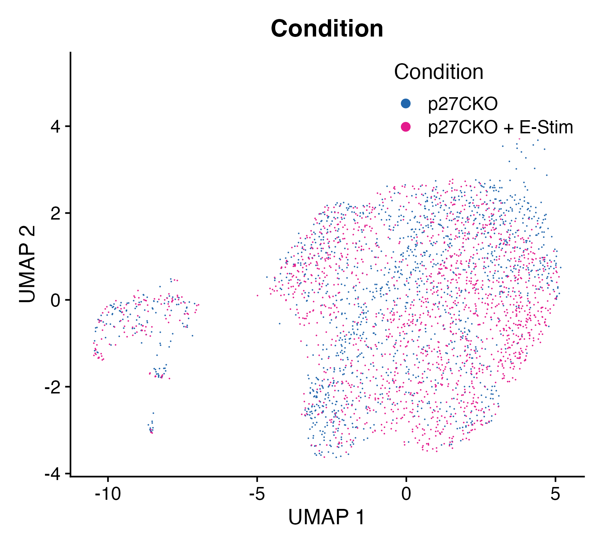{#fig-mg-selected-condition-umap}

### Cluster marker genes

I used `Seurat::FindAllMarkers()` to identify positive and negative markers for each cluster in the filtered dataset. I retained both directions and ranked results within each cluster by adjusted p-value, raw p-value, and then average log2 fold change. Positive markers have higher average expression in the cluster than in all other cells; negative markers have lower average expression.

Top results:

* Cluster 3 has positive markers including `Ascl1`, `Chrna4`, and `Hes6`.
* Cluster 4 has positive markers including `Stmn3`, `Neurod4`, and `Ina`.
* Cluster 5's top-ranked results include the negative markers `Samm50` and `Scamp3`.
* Cluster 6 has positive cell-cycle-associated markers including `Esco2`, `Tk1`, and `Neil3`.

{#fig-mg-selected-find-all-markers-dotplot}

Note: don't talk about markers like they're differentially expressed genes. The best statistical way to test differential expression is pseudobulk DESeq2 with ~ mouse + condition. Anything else is anecdotal evidence so don't overinterpret it.

### Curated markers and treatment-dependent results

#### Cluster enrichment in E-Stim

The cluster-abundance summary is descriptive because cells, not Mouse ×
Condition samples, are counted in the Fisher tests.

{#fig-mg-selected-cluster-abundance-clr-fisher}

With two paired samples and two singleton samples, condition-level abundance
claims should be framed cautiously as data-consistent patterns rather than
strong statistical conclusions. The cluster-proportion plot shows the Mouse ×
Condition sample structure directly.

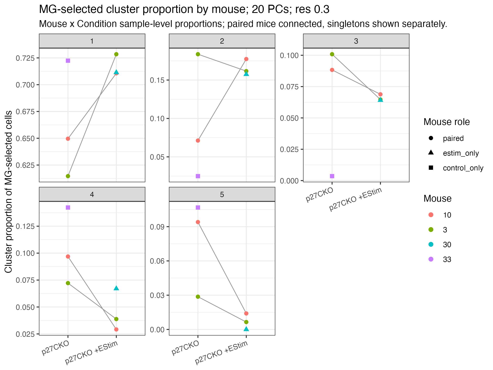{#fig-mg-selected-cluster-proportion-by-mouse}

#### Curated marker genes

The marker heatmap below shows the same `mg-selected` clustering
(`cluster_pflog_mg_selected_no_filter_cc_dims20_res0.3`). Columns are cells split
by Leiden cluster, with cluster blocks hierarchically ordered by their
marker-expression profiles. Rows are marker genes grouped by their expected
cell-type labels. Colors show each gene's row z-score across cells, clipped to
$\pm 2$.

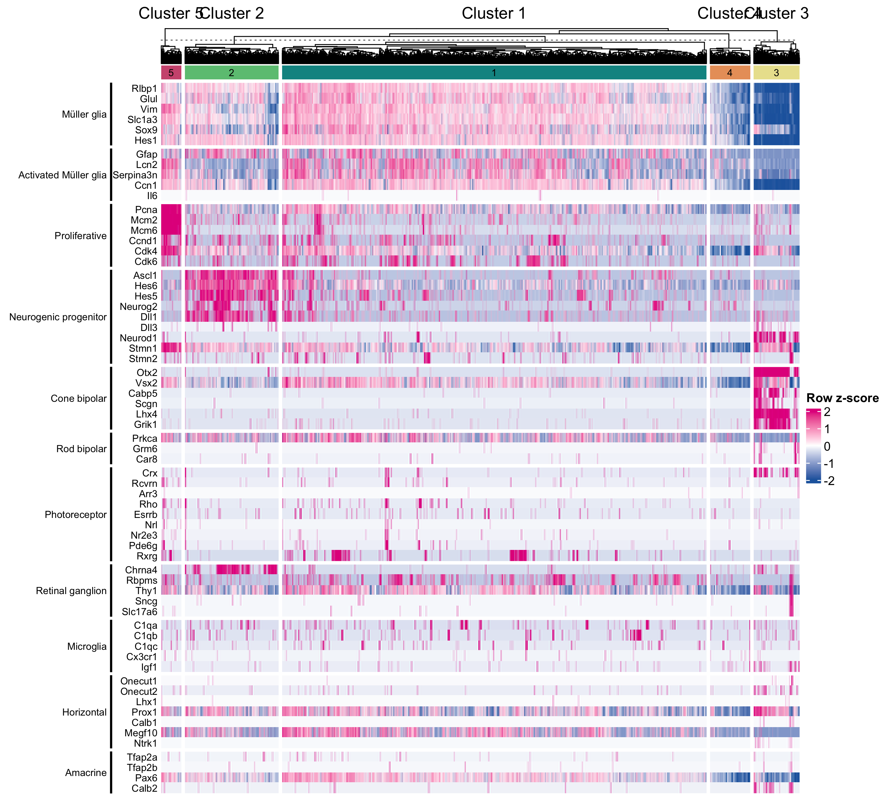{#fig-mg-selected-cell-type-marker-heatmap}

The feature UMAP grid uses the marker feature list in `data/umap_feature_list.rda`
and the same pink high-expression endpoint as the marker heatmap.

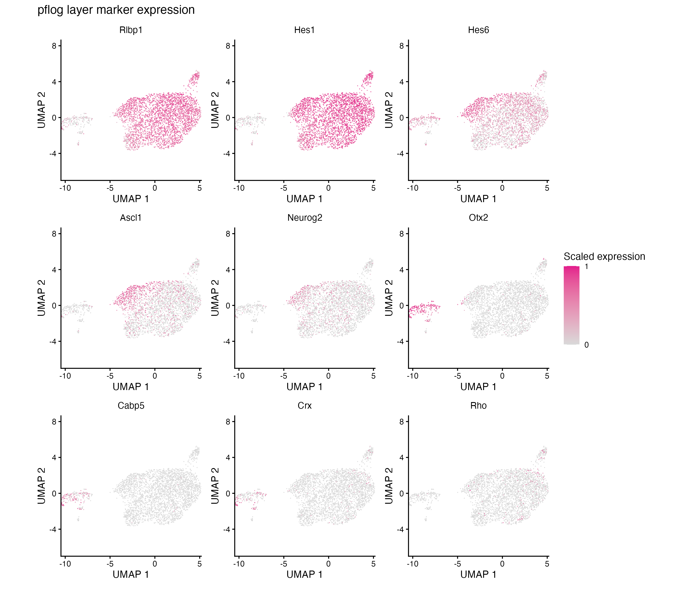{#fig-mg-selected-feature-umap-grid}

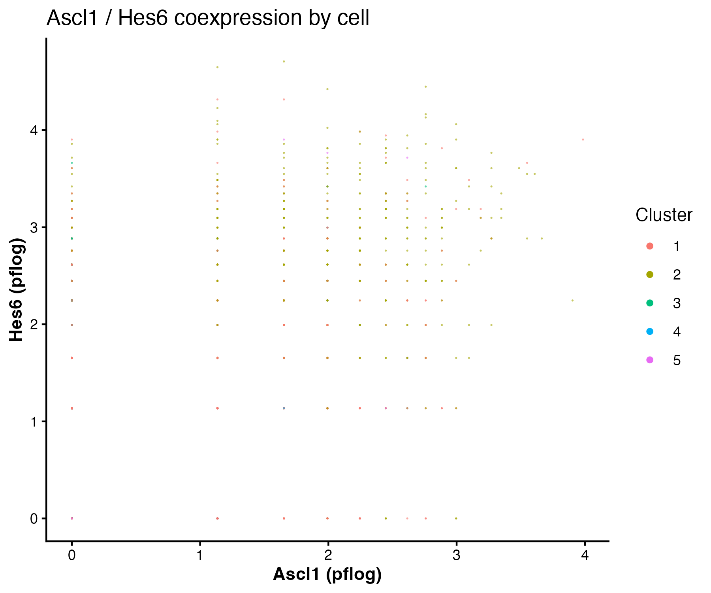{#fig-mg-selected-ascl1-hes6-coexpression}

As a complementary check, I also reviewed the matching PFlog,
cell-cycle-filtered 20-PC, resolution-0.3 branch. The UMAPs show the Leiden
cluster IDs and condition overlay for that branch.

{#fig-mg-selected-filter-cc-cluster-umap}

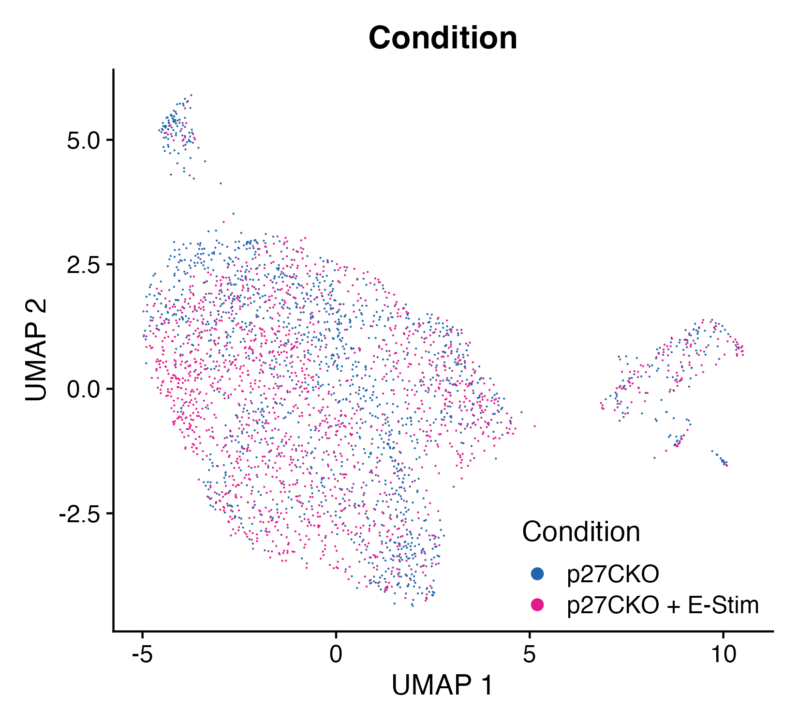{#fig-mg-selected-filter-cc-condition-umap}

The cell-cycle-filtered branch uses the same curated marker heatmap and feature
UMAP panels as the no-cell-cycle-filtered branch.

{#fig-mg-selected-filter-cc-cell-type-marker-heatmap}

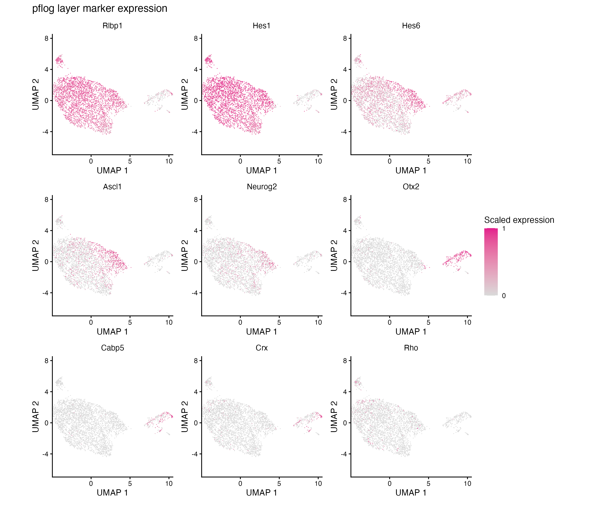{#fig-mg-selected-filter-cc-feature-umap-grid}


## Differential expression

I tested condition-level changes in the `mg-selected` branch with Mouse ×
Condition pseudobulk samples as the statistical unit. The primary DESeq2 design
used `~ condition` across all six Mouse × Condition samples. The paired
`~ mouse + condition` design used only mice 10 and 3, so I treat it as a
sensitivity analysis rather than the primary result.

Primary DESeq2 tested 17,043 genes and found 448 FDR-significant genes for
E-Stim versus `p27CKO`: 139 increased and 309 decreased with E-Stim. Eight
curated marker-list genes were significant. `Glul` (Müller glia), `Ccn1`
(activated Müller glia), `Hes6` (neurogenic progenitor), and `Grm6` (rod
bipolar) increased with E-Stim. `Mcm2`, `Mcm6`, and `Pcna` (proliferative) and
`Rcvrn` (photoreceptor) decreased. The paired sensitivity DE analysis found 125
FDR-significant genes. The strongest design-robust curated marker signals are
concordant in the primary and paired-sensitivity analyses: increased `Glul` and
`Ccn1` and decreased `Mcm2` and `Mcm6`. `Hes6`, `Pcna`, `Grm6`, and `Rcvrn` are
primary-model hits but do not remain FDR-significant in the paired sensitivity.

The primary-model volcano plot summarizes the `full_de` table from the all-sample `~ condition` DESeq2 model. The x-axis is the shrunken `log2FoldChange` (positive values indicate higher expression with E-Stim), and the y-axis is `-log10(pmax(padj, .Machine$double.xmin))`. Genes are significant when `padj < 0.05`, without a fold-change cutoff. Colors encode the three direction/significance levels: **Not significant**, **Increased** (significant with positive shrunken log2 fold change), and **Decreased** (significant with negative shrunken log2 fold change). Labels show the top 20 increased and top 20 decreased genes, selected independently within each direction and ranked by raw p-value ascending, with absolute shrunken log2 fold change and gene name as deterministic tie-breakers. The plot uses only the primary `full_de` results; the paired DE sensitivity remains summarized above.

{#fig-mg-selected-de-volcano}

As follow-up summaries of this selected branch, upregulated DEGs are enriched
for nitric-oxide, vascular-growth, and apoptotic-signaling terms, while
downregulated DEGs and preranked GSEA are dominated by cell-cycle,
chromosome-segregation, and DNA-replication terms.

## Functional enrichment

I summarized the primary `~ condition` DESeq2 result with GO Biological Process enrichment. Over-representation analysis (ORA) uses the FDR-significant increased and decreased gene sets; preranked GSEA uses the DESeq2 Wald statistic over all tested genes. Redundant ontologies are collapsed with `clusterProfiler::simplify()`. As an exploratory comparison, I also applied Bayesian term selection (`enrichit::bayes_enrich()`) to the ORA results before simplifying. Dotplots show gene ratio (ORA) or the activated/suppressed split (GSEA), with point size for gene count and color for adjusted p-value.

### GO over-representation (simplified)

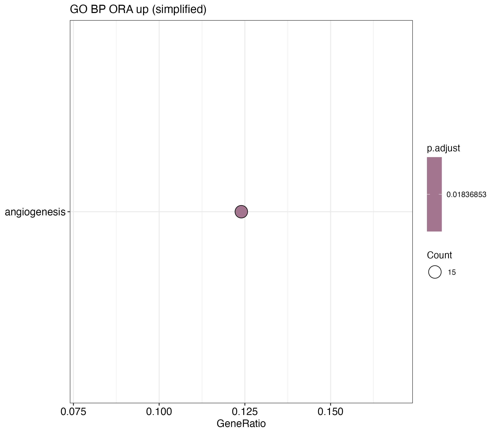{#fig-mg-selected-go-ora-up}

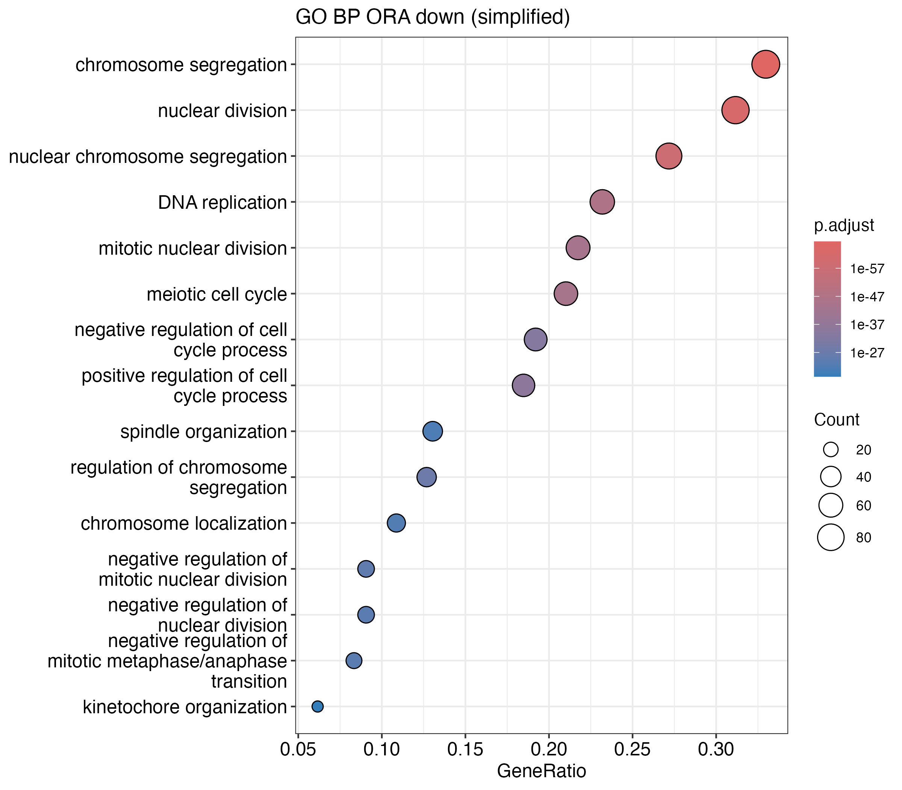{#fig-mg-selected-go-ora-down}

### GO GSEA (simplified)

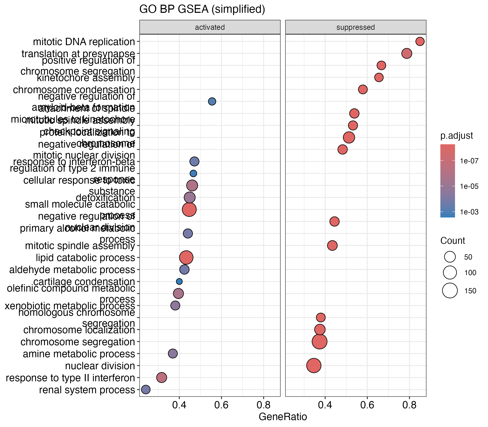{#fig-mg-selected-go-gsea}

### Bayesian term selection (exploratory)

{#fig-mg-selected-go-ora-up-bayes}

{#fig-mg-selected-go-ora-down-bayes}
